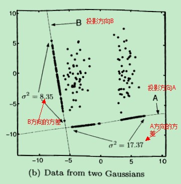
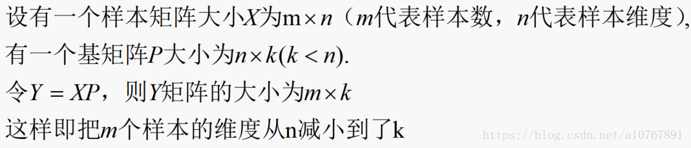
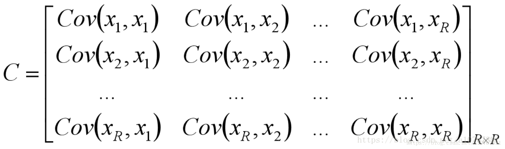
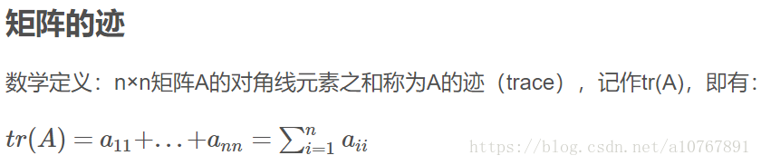
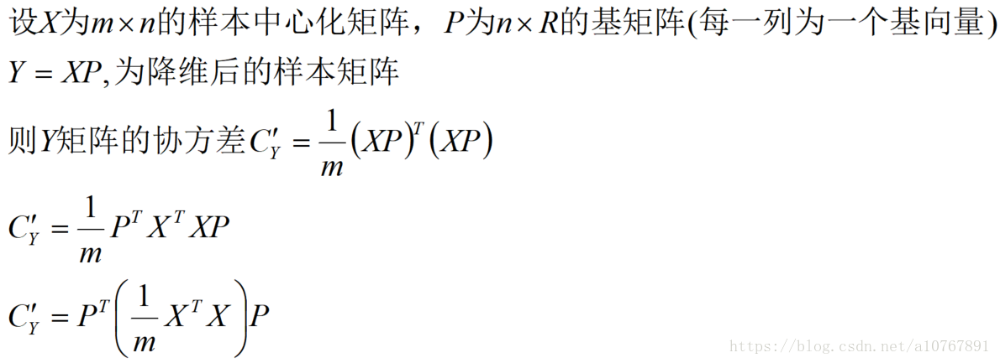
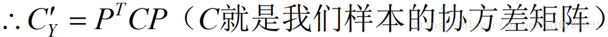
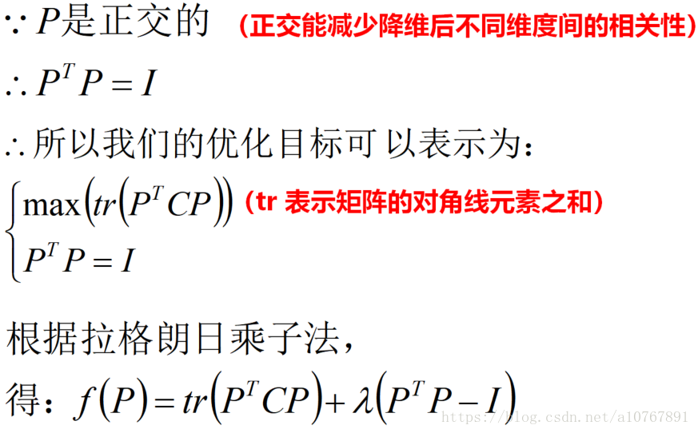
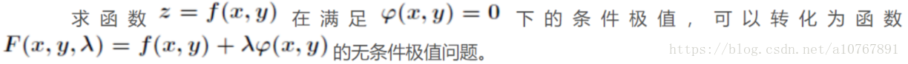
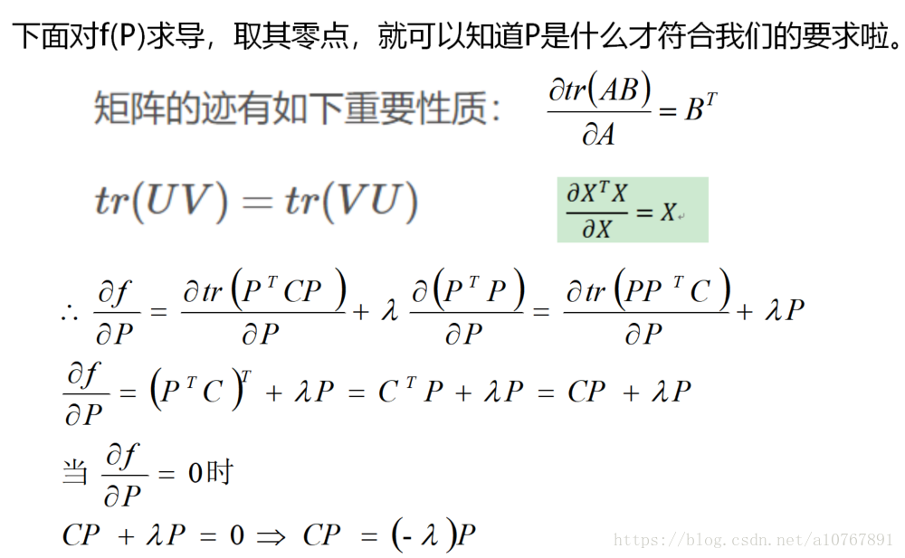
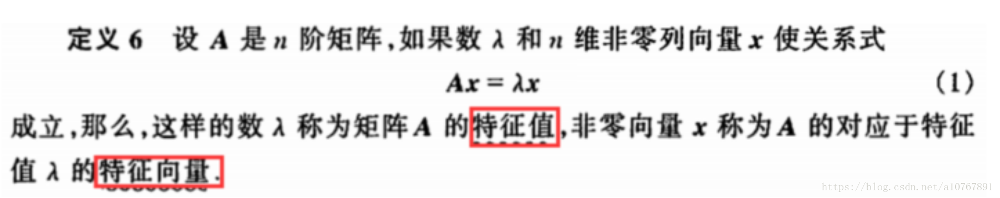

[toc]

---
#PCA主成分分析
@(机器学习)
##简介
在主成分分析中，它试图找到一个低维的空间，来对数据进行投影，以便最小化投影误差的平方，即最小化每个点与投影后相对应的点距离的平方，实际是求最小投射平方误差。
下图说明低维投影面的选择可以影响对数据的后续处理

上图中有“两团点”，亦称为两个聚簇。将这两个簇中的点往B方向投影，投影之后得到的新样本点，已经看不出有两个簇了。此时，得到的方差是$σ_{2B}=8.35$.

往A方向投影，还能够明显地看出有 两类，即还能够保存“两个簇“的结构，这说明投影方向A比B 要好，此时得到的方差$σ_{2A}=17.37$.

这表明：可以使用 投影后的所有样本点的 方差大小，来衡量投影方向的好坏！

##PCA的优化目标
###方差
PCA变换其实就是一种降维技术。上文中对原始数据**选择投影面**可以用**矩阵变换来**做。


维数减少了，虽可大大减少算法的计算量，但是若对**基矩阵P**选择不当的话就很有可能会导致**信息量的缺失**。

因此我们要选择哪K个基(这里还不知道是特征向量)才能保证降维后能最大程度保留原有的信息，是进行设计的主方向。
> 信息论中，某个维度的信息越大，则它的方差越大，正如上图描述

因此，可以很容易联想到第一个优化目标：降维后各维度的方差尽可能大。
###相关性
因为如果某2个维度间存在相关性，就说明从一个维度的值可以推测出另一个维度的值。说明该维度中有一个是多余的，那自然可以把其中一个维度舍去。
> 其实就是要降维后的两个维度的向量线性无关
###优化目标【重要点】
1） 降维后同一纬度的方差最大
2） 不同维度之间的相关性为0

## 推导过程
###优化目标
线性代数中，可以知道同一元素的协方差就表示该元素的**方差**，不同元素之间的协方差就表示它们的**相关性**。因此这两个优化目标可以用**协方差矩阵**来表示，下图表示降维效果最理想的结果：


注意：
1)相同元素的方差是为0的
2)[为什么协方差能表示相关性](https://blog.csdn.net/huntinggo/article/details/47430777)

可以知道优化目标一便是令$C_y$矩阵的对角线元素之和最大。即$max\  tr(C_y)$
###优化过程
我们要做的就是想尽一切办法去达到我们的优化目标。
下面便是推导过程：


C为样本的协方差矩阵的简易求法（==需要先对原始数据X减去均值然后除以标准差==，才能和定义式相同）




PS：拉格朗日乘子法定义如下


根据特征值与特征向量的定义：


可以看到，最终求得的结果满足特征向量的关系式，因此由X的协方差矩阵C矩阵的特征向量所构成的基矩阵，就是我们要求的变换矩阵。

由该矩阵降维得到的新样本矩阵可以最大程度保留原样本的信息。

比如我们要将m条样本，每条样本有n个特征的数据$X_{m*n}$降维为k维（k<n），则依上法求出变换矩阵$P_{n*n}$，选择前k列，做矩阵乘法$Y_{m*k}=XP_{n*k}$，$Y$ 便是我们降维后的数据。

##算法步骤
步骤 5 步：

1. 标准化：去平均值，也就是将向量中每一项都减去各自向量的平均值，再除以标准差
2. 计算矩阵的协方差矩阵，再计算协方差矩阵的特征值和特征向量
3. 把特征值从大到小排列
4. 取前K个特征值对应的特征向量，
5. 对所有的向量以这个K个向量为基向量投影到到一个新的（低维度）空间，

[PCA之前为什么要标准化](https://www.jianshu.com/p/ae9db78ebb0f)

##代码实例
```
def PCA(X,k):#X维度为m*n，m条数据，n条特征，k为指定降维后的特征维度，k<n
    m,n = X.shape
    if k >= n or k <1:
        k = n
    #中心化
    X = X - np.mean(X,axis=0,keepdims=True) 
    #求协方差矩阵
    cov_matrix = np.cov(X.T)#cov是按X的行计算协方差，但是我们是要按列计算，所以要转置
    #对协方差矩阵求特征之及特征向量
    eig_val, eig_vec = np.linalg.eig(cov_matrix)
    #对特征向量按特征值的大小降序排列
    eig_pairs = [(np.abs(eig_val[i]), eig_vec[:,i]) for i in range(n)]
    eig_pairs.sort(reverse=True)
    #选择前k个特征向量组成变换矩阵
    feature=np.array([ele[1] for ele in eig_pairs[:k]]) 
    return np.dot(X,feature.T)
```
